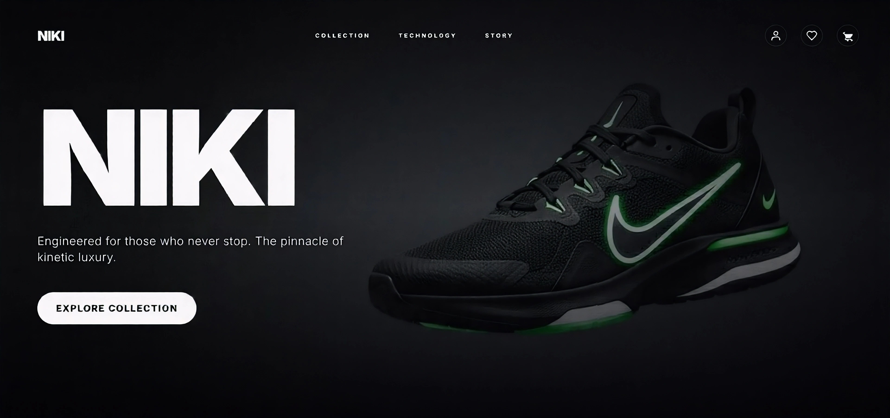

# Niki - Premium Cinematic Footwear



[Live Demo](https://niki-ecommerce.vercel.app/)

Niki is a high-end e-commerce platform dedicated to premium footwear, designed with a "cinematic" user experience. It combines modern web technologies with immersive design to create a fluid and engaging shopping journey.

## 🚀 Features

### Storefront
- **Cinematic Experience**: Immersive Hero section with video/image backgrounds and smooth animations.
- **Product Catalog**: Advanced filtering and search capabilities for footwear.
- **Product Details**: High-quality image galleries, detailed specifications, and related products.
- **Shopping Cart**: Real-time cart management using Zustand with persistent state.
- **Wishlist**: Save favorite items for later.

### User Experience
- **Authentication**: Secure login and registration via Email/Password, Google, and GitHub (powered by Better Auth).
- **User Profile**: Manage personal information and shipping addresses.
- **Order History**: View past orders and status.

### Checkout & Payments
- **Stripe Integration**: Secure checkout process with Stripe.
- **Address Pre-filling**: Automatically uses saved user addresses for a faster checkout.

### Admin Dashboard
- **Product Management**: Create, edit, and delete products.
- **Order Management**: View and filter customer orders.
- **Access Control**: Protected routes restricted to authorized admin users.

## 🛠 Tech Stack

- **Framework**: [Next.js 16](https://nextjs.org/) (App Router)
- **Language**: [TypeScript](https://www.typescriptlang.org/)
- **Styling**: [Tailwind CSS](https://tailwindcss.com/)
- **Database**: [PostgreSQL](https://www.postgresql.org/) (via [Neon Serverless](https://neon.tech/))
- **ORM**: [Drizzle ORM](https://orm.drizzle.team/)
- **Authentication**: [Better Auth](https://www.better-auth.com/)
- **Payments**: [Stripe](https://stripe.com/)
- **State Management**: [Zustand](https://zustand-demo.pmnd.rs/)
- **Testing**: [Vitest](https://vitest.dev/) & [React Testing Library](https://testing-library.com/)

## 📂 Project Structure

```
├── app/                  # Next.js App Router pages and API routes
│   ├── admin/            # Admin dashboard routes
│   ├── api/              # Backend API endpoints (Auth, Webhooks)
│   ├── (auth)/           # Authentication pages (Login, Register)
│   ├── products/         # Product browsing pages
│   ├── profile/          # User profile pages
│   └── checkout/         # Checkout flow pages
├── components/           # Reusable React components
│   ├── admin/            # Admin-specific components
│   ├── products/         # Product-related components
│   └── ui/               # Generic UI components
├── lib/                  # Utilities and core logic
│   ├── actions/          # Server Actions
│   ├── db/               # Database client and schema definitions
│   └── utils/            # Helper functions
└── public/               # Static assets
```

## ⚡ Getting Started

### Prerequisites
- Node.js (v18 or higher)
- pnpm (recommended) or npm/yarn
- A PostgreSQL database (e.g., Neon)
- Stripe account

### Installation

1.  **Clone the repository:**
    ```bash
    git clone https://github.com/yourusername/niki-premium.git
    cd niki-premium
    ```

2.  **Install dependencies:**
    ```bash
    pnpm install
    ```

3.  **Environment Setup:**
    Create a `.env.local` file in the root directory and add the following variables:

    ```env
    # Database (Neon)
    DATABASE_URL=postgres://...

    # Authentication (Better Auth)
    BETTER_AUTH_SECRET=your_secret_here
    BETTER_AUTH_URL=http://localhost:3000

    # OAuth Providers
    GOOGLE_CLIENT_ID=your_google_client_id
    GOOGLE_CLIENT_SECRET=your_google_client_secret
    GITHUB_CLIENT_ID=your_github_client_id
    GITHUB_CLIENT_SECRET=your_github_client_secret

    # Payments (Stripe)
    STRIPE_SECRET_KEY=sk_test_...
    STRIPE_WEBHOOK_SECRET=whsec_...
    NEXT_PUBLIC_STRIPE_PUBLISHABLE_KEY=pk_test_...

    # Admin Access
    ADMIN_EMAIL=your_admin_email@example.com
    ```

4.  **Database Setup:**
    Push the schema to your database and seed initial data:
    ```bash
    pnpm db:push
    pnpm db:seed
    ```

5.  **Run the development server:**
    ```bash
    pnpm dev
    ```
    Open [http://localhost:3000] to view the application.

## 📜 Scripts

- `pnpm dev`: Starts the development server.
- `pnpm build`: Builds the application for production.
- `pnpm start`: Starts the production server.
- `pnpm db:generate`: Generates SQL migrations based on Drizzle schema.
- `pnpm db:push`: Pushes schema changes directly to the database.
- `pnpm db:seed`: Seeds the database with sample products.
- `pnpm test`: Runs the test suite using Vitest.

## 📄 License

This project is proprietary and intended for educational or portfolio purposes.
# niki-ecommerce
